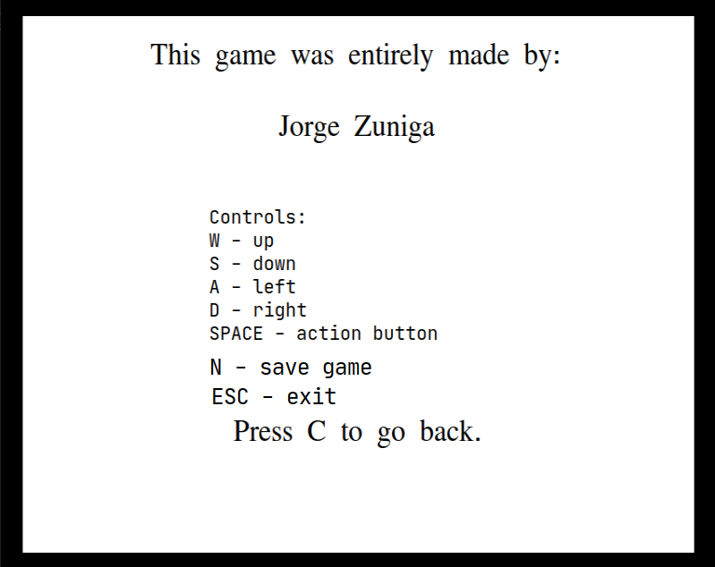
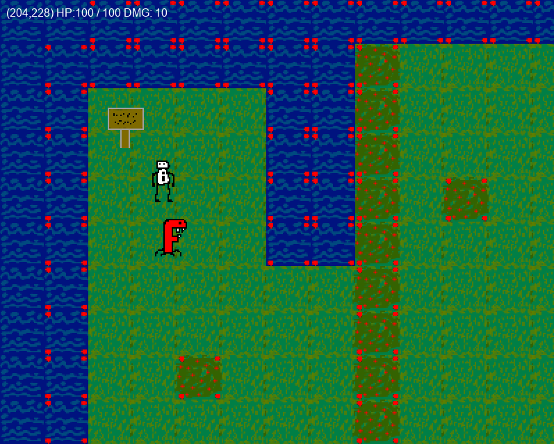
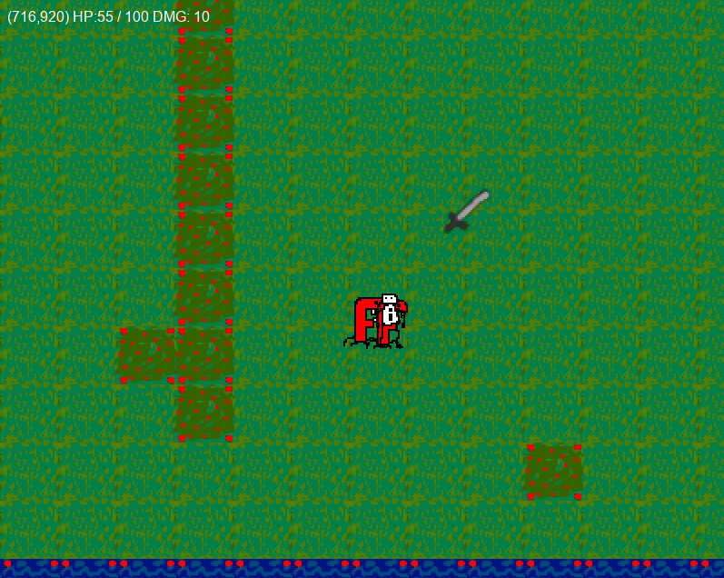
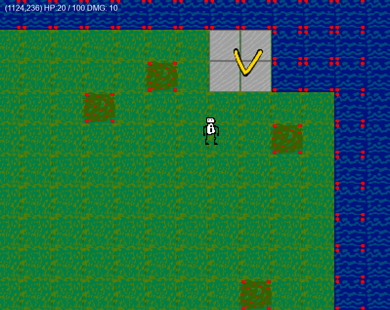
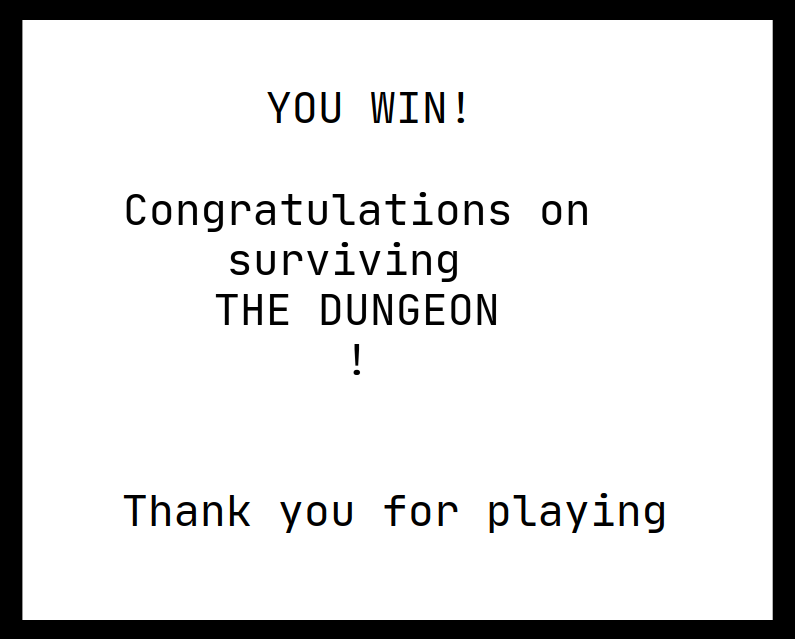

# Welcome to my RPG game engine

This is a relatively small rpg game engine with the capabilities of easy future expansions thanks to the use of an ECS.  
I've never made a game before and I greatly regret ever trying to do one. This feels beyond my capabilities. But it's too late to do any other project now. 
### Main feature:

The engine implements an ECS.   
https://en.wikipedia.org/wiki/Entity_component_system  

Every object in the game is a generic entity which has components that change its behaviour.  
Every entity holds the components in a container and during the init, update and render phase use polymorphism to adjust behaviour.  
Components are implemented individually and more components can be implemented and added easily 
thanks to the way this engine is build.  

### What the engine can do:

+ Allows to read a map from a file.  
+ Uses PNG textures so the graphics can be modified.  
+ Uses an asset factory to easily access textures, create items and monsters. 
+ Reads keyboard input and moves the character accordingly.  
+ Implements a camera system which follows the player and doesnt go out of bounds.
+ Implements sprite animations.
+ Implements a log function which allows to log events to the 
+ Implements a basic AI that can follow other entities.
+ Supports saving.  
+ Implements a basic item system.
+ Implements basic combat.

### Preview images:

